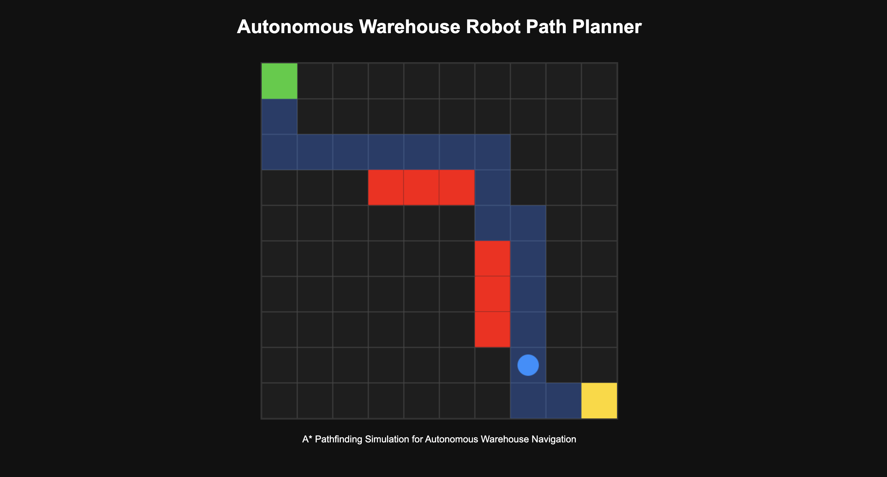

# Autonomous Warehouse Robot Path Planner

A robotics-focused simulation project demonstrating autonomous warehouse navigation using path planning and obstacle avoidance concepts.

The project combines a C++ pathfinding engine with a browser-based visualization layer to simulate autonomous robot movement inside warehouse environments.

<div align="center">

  
  <p align="center">
    Autonomous warehouse robot navigation simulation using A* pathfinding and obstacle-aware route planning.
  </p>

  <br/>

</div>

---

## Features

- Autonomous warehouse navigation simulation
- A* pathfinding logic
- Obstacle-aware route planning
- Real-time robot movement visualization
- Grid-based warehouse environment
- Browser-based simulation rendering
- C++ algorithm implementation

---

## System Overview

The simulation demonstrates how autonomous warehouse robots can calculate optimized navigation paths while avoiding obstacles and dynamically traversing operational environments.

The visualization layer renders robot movement and planned navigation paths inside a warehouse grid system.

---

## Tech Stack

### Backend Logic
- C++
- A* Pathfinding Algorithm

### Visualization
- HTML
- CSS
- JavaScript
- Canvas API

---

## Project Structure

```bash
autonomous-warehouse-path-planner/
│
├── main.cpp
├── index.html
├── style.css
├── script.js
├── README.md
│
└── Images/
      └── warehouse-navigation-preview.png
```

---

## Run Locally

### Run C++ Pathfinding Engine

Compile:

```bash
g++ -std=c++17 main.cpp -o planner
```

Run:

```bash
./planner
```

---

### Run Visualization

Open:

```bash
index.html
```

Or use VSCode Live Server.

---

## Future Improvements

- Dynamic obstacle movement
- Multi-robot coordination
- ROS integration concepts
- Sensor simulation
- Real-time telemetry systems
- Advanced warehouse optimization

---

## Simulation Concepts

- Autonomous Navigation
- Warehouse Robotics
- Path Optimization
- Obstacle Avoidance
- Intelligent Routing
- Robotics Simulation Systems